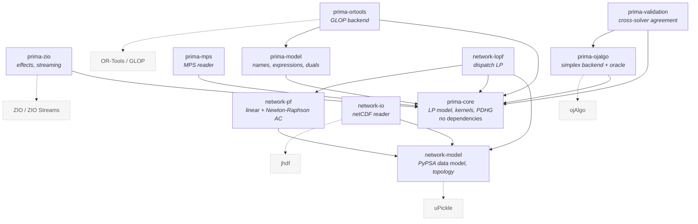
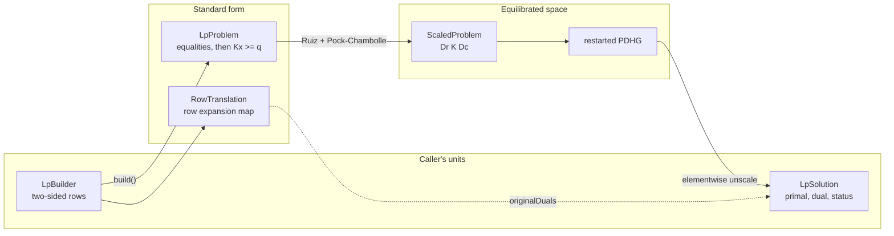
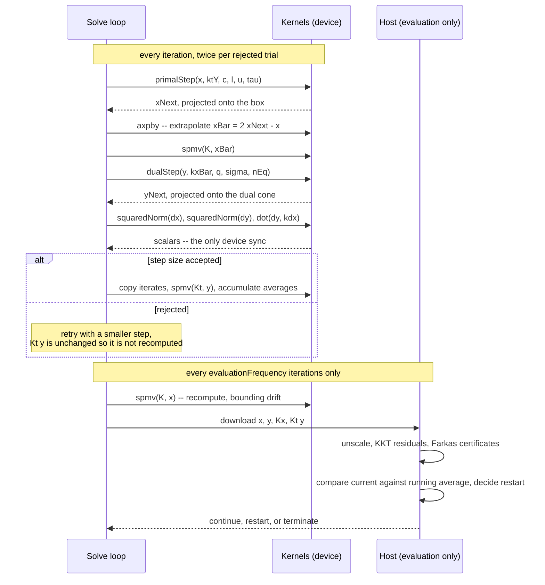
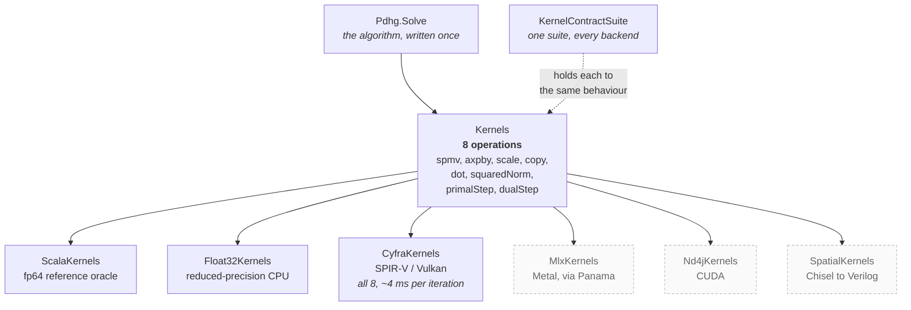
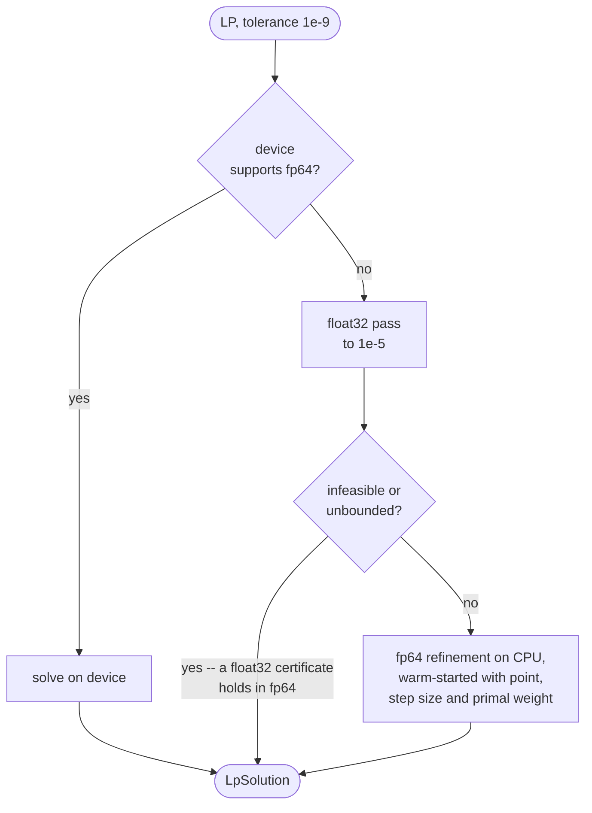
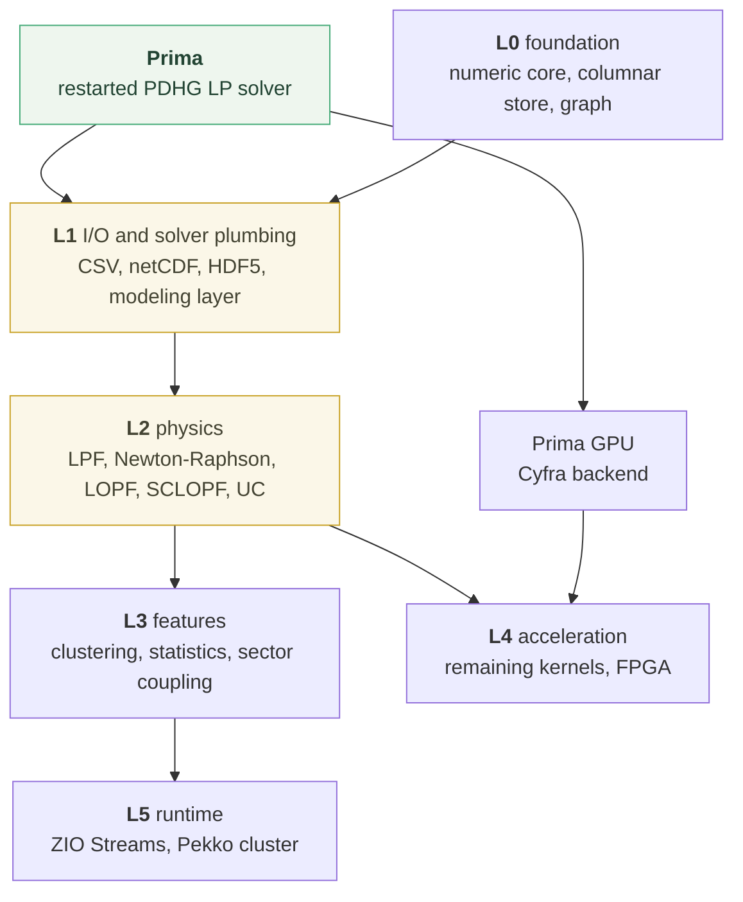

# Architecture

How this codebase is put together and why. Read
[`README.md`](README.md) first for what it is;
[`modules/prima-core/NOTES.md`](modules/prima-core/NOTES.md) has the numerical
detail this document deliberately skips.

Prima, the LP solver, came first, and L0 through L2 are built on it: the network
data model, PyPSA's CSV and netCDF readers, linear and Newton-Raphson AC power
flow, and dispatch LOPF with storage, capacity expansion, security constraints
and unit commitment. L3 upwards is drawn here because the shape of Prima was
chosen to serve it.

## The governing constraint

Everything below follows from one requirement: the numeric hot paths must be
able to run on a GPU, and eventually be compiled to hardware, from Scala.

That rules out the usual JVM answer of "write it in idiomatic Scala and
optimise later". Immutable collections and higher-order iteration box primitives
and block inlining, which is fatal in a sparse matrix-vector product. It equally
rules out writing the whole thing in mutable low-level style, because then the
model, the effects and the orchestration become unreadable and unsafe.

The resolution is a hard boundary. Above it: immutable values, ZIO effects,
composition. Below it: primitive arrays, `while` loops, and a small interface
that an accelerator can implement. The boundary is the `Kernels` trait, and
almost every structural decision in this document is about keeping it in the
right place.

## Modules

`network-pf` does '''not''' depend on `prima-core`, and that absence is the point.
Power flow takes dispatch as given: the linear form is one symmetric
positive-definite solve per sub-network, and the Newton-Raphson form is a
sequence of unsymmetric ones. Neither is an optimisation, and routing them
through an LP solver would both misrepresent the problem and couple two layers
that have no reason to meet. The module carries its own dense Cholesky and LU —
two routines rather than one, because the Newton Jacobian is unsymmetric so
Cholesky does not apply to it — and both double as the fp64 oracles for the
sparse factorisations a country-scale network will need.

`network-lopf` depends on `network-pf`, which looks backwards for a module whose
job is optimisation. It is there for SCLOPF: the outage distribution factors an
N-1 secure dispatch is built from are a power-flow sensitivity, not an
optimisation concept. Deriving them inside the LP module would put a second
definition of susceptance and slack in the tree, and the two would drift.

`network-io` reads PyPSA's netCDF export into the model `network-model` defines,
so both readers answer to the same golden networks. That is also why the two
share a refusal type rather than each owning one: `UnsupportedNetworkFile` is
raised for a file that is *well formed and not modelled here* — a piecewise cost
curve is exactly what PyPSA meant to write — and is deliberately distinct from
either reader's `MalformedNetwork`, which is for a file that is broken. The two
have different remedies, so a caller has to be able to tell them apart on the
type. A refusal in one reader is half a refusal, and both spellings of a feature
are refused in the reader that meets them.

`prima-core` has no third-party dependencies at all. That is not minimalism for
its own sake: it is what lets the solver be called from a Pekko actor, a ZIO
fiber, a test harness or an FPGA toolchain's host program without dragging an
effect system along. The effect system lives in `prima-zio`, one module out.

`prima-validation` exists as a separate module rather than as tests inside
`prima-ojalgo` because its job is to compare two backends, so it belongs to
neither.

`prima-model` depends on `prima-core` and on nothing else, which is the whole of
what makes it a modeling layer rather than a front end. It compiles a model into
an `LpProblem` and hands that to an `LpSolver`; it never names one. The three
backends meet in `prima-ortools`'s test scope, because that is the only module
that can see all of them at once, and one model solved by a first-order method,
a pure-JVM simplex and GLOP agreeing on flows and prices is what the layer is
for.

`network-lopf` still keeps its own map from `(component, entity, snapshot)` to a
column index rather than being written against `prima-model`. That is not an
oversight and it is not a recommendation: the L2 model is gated on golden-file
comparison against a pinned PyPSA, and rewriting how it is built is a change
whose only honest test is that gate, so it is a change to make on its own. What
it does now take is an `LpSolver`, which is the part that made it
solver-dependent.

## The solve pipeline

Three coordinate systems, and a value is never allowed to be ambiguous about
which one it is in.

**Caller's units.** Rows are written as `lo <= a'x <= hi`, which is how a power
flow limit or a generator capacity is actually expressed.

**Standard form.** Equalities first, then `Kx >= q`. The ordering is load
bearing: it makes the dual cone a suffix condition — `y` free on the head,
non-negative on the tail — so the dual projection is a contiguous clamp. On a
GPU that is one branch-free kernel rather than a per-row predicate.

Converting to this form expands range rows into two, which is why `build()`
returns a `RowTranslation` as well as a problem. Without it, a caller asking for
nodal prices would get duals indexed by rows they never wrote.

**Equilibrated space.** The iteration runs on `Dr K Dc`. Power-system LPs mix
line susceptances and generator capacities across many orders of magnitude, and
a first-order method's convergence rate depends directly on that conditioning.

The important rule: **convergence is judged in the caller's units, never the
equilibrated ones.** A tolerance of `1e-9` on a rescaled residual means nothing.
Because the preconditioner is diagonal, the original matrix products come back
from the scaled ones by an elementwise divide — `Kx = (K~ x~) / Dr` — so this
costs `O(m+n)` per evaluation and not a single extra sparse product.

## Anatomy of one iteration

Two sparse products per iteration and no factorisation. That is the whole reason
this algorithm was chosen over simplex or interior-point: it is the only family
whose inner loop survives being moved onto an accelerator.

Three details in that diagram are worth naming, because each one removes work
that a naive implementation would do:

- **`K dx` is never computed.** It falls out of the extrapolation:
  `K xBar = 2 K xNext - K x`, so `K dx = (K xBar - K x) / 2`.
- **A rejected step costs one sparse product, not two.** `y` has not moved, so
  `Kt y` is still valid.
- **The running averages include the matrix products.** Averaging `Kx` and
  `Kt y` alongside `x` and `y` costs two vector operations per iteration and
  saves two sparse products at every evaluation.

Reductions are the only place the device must synchronise with the host, which
is why the adaptive step-size rule is written to need exactly three of them.

## The kernel seam

Solid boxes exist; dashed ones do not yet.

The interface is eight operations, and keeping it that small is a deliberate,
ongoing constraint rather than a happy accident. Restart bookkeeping, KKT
evaluation and infeasibility certificates all run on the host, at evaluation
points tens of iterations apart, precisely so they never become something a
backend has to implement. Adding a ninth operation should feel expensive.

`Vec` and `Mat` are abstract type members, so a backend can hold iterates in
device memory and the solver loop never sees a host array. The CPU reference
instantiates them to `Array[Double]`.

`KernelContractSuite` is written against the trait, not against
`ScalaKernels`. A new backend inherits the entire behavioural contract by
supplying one method that constructs it. Tolerances there admit a different
reduction order — a GPU reduces in tree order and will not match the host's
index order bit-for-bit — but nothing looser than that.

### Precision is a declared capability

`KernelCapabilities.supportsFloat64` is declared per backend, and
`requiresDoublePrecisionRefinement` derives from it, because **every accelerator
in prospect is float32-only**. Cyfra's DSL has no double type on any target, and
Apple GPUs expose none through Vulkan or Metal regardless. Reduced precision is
the normal case, not a vendor quirk.

`Float32Kernels` is a CPU backend that rounds every operation to float32. It
exists so the reduced-precision question can be answered without a GPU: running
the experiment on real hardware would confound the algorithm's precision
sensitivity with SPIR-V correctness and driver behaviour, and only the first of
those is a design input.

`MixedPrecision` composes the two — reduced pass on the device, then a
double-precision refinement on the CPU warm-started from it. The result always
comes from the double-precision pass, so accuracy never depends on the device.

The warm start carries the adapted step size and primal weight, not just the
point. That is not tuning: handing over the point alone makes large instances
*slower* than a cold solve, because the adaptive rules need thousands of
iterations to settle and a solve resuming near the optimum with fresh state
spends longer unwinding the mismatch than a cold solve spends converging.

This path is opt-in, and deliberately so. It removes 75–100% of double-precision
work on structured problems but is measurably worse on dense random LPs at tight
tolerance, for reasons not yet understood.
[`NOTES.md`](modules/prima-core/NOTES.md) has the numbers.

## Where this fits in the port

Green is complete, amber partial. L1 reads and writes PyPSA's CSV directory
format and round-trips it byte-for-byte, and reads PyPSA's netCDF export into the
same model; `.h5` is not read, because PyPSA's is pandas' PyTables layout with
pickled column metadata (see NOTES). L2 has linear power flow and Newton-Raphson
AC power flow (both matching PyPSA's angles to 1e-9) and dispatch LOPF with
Kirchhoff cycle constraints, storage and stores, capacity expansion, delayed
links, multi-investment periods, SCLOPF via outage distribution factors, and unit
commitment through Prima's own branch-and-bound. The DC half of "Newton-Raphson
AC/DC" is absent because the pinned PyPSA does not implement it either, so there
is nothing to validate it against.

What each of those does *not* cover is recorded in
[`modules/prima-core/NOTES.md`](modules/prima-core/NOTES.md), and refused in code
rather than left to this list — a gap is only honest if it is loud, which is what
`GapRefusalSuite` and `SchemaSweepSuite` exist to keep true.

Prima came first, ahead of the foundation layer, because it is the highest-risk
piece and the one nothing else could substitute for: a GPU-accelerated
first-order LP solver in Scala did not previously exist. L0 is conventional work
over well-understood libraries; if it had been built first, the project's
riskiest assumption would still be untested.

From L1 onward every module is gated on golden-file comparison against a pinned
PyPSA run, and that harness now exists. The pin is the `pypsa==` in
`reference/README.md`'s install command; `reference/generate_goldens.py` pins
nothing itself. It records whichever version produced the goldens into
`reference/goldens/manifest.json`, and writes the schema, exported tables,
sub-network decomposition, LPF and optimisation results beside it under
`reference/goldens/` — the manifest carries versions and summaries, not the
artefacts themselves.

Prima itself is validated against ojAlgo and the Netlib corpus instead, which are
the right oracles for an LP solver and the wrong ones for a network model.

Generating the goldens '''before''' designing anything that consumes them has paid
for itself repeatedly. Three PyPSA conventions that documentation does not state,
and that were each caught by a golden rather than by reasoning: CSV export omits
columns never *set* rather than columns holding defaults; `p_set` defaults to NaN
for every one-port except Load, so a generator with no setpoint is idle rather
than erroneous; and the LPF slack is the first *generator's* bus in file order,
not the first bus. The last of those is the sharpest — a wrong slack shifts every
voltage angle by a constant and leaves the flows correct, so it reads as a scaling
bug rather than a convention error.

## Invariants

Rules that hold across the codebase. Breaking one is a design change, not a
refactor.

| Invariant | Why |
| --- | --- |
| `prima-core` has no third-party dependencies | It must be callable from any host, including an FPGA toolchain's driver program |
| Public API speaks `IArray`, kernels take `Array` | Immutability at the boundary at zero runtime cost; every conversion goes through `Unsafe` |
| Convergence is judged in the caller's units | A tolerance on an equilibrated residual is meaningless |
| Equality rows precede inequality rows | Makes the dual projection a contiguous clamp |
| Infeasible or unbounded is reported only from a certificate | Hitting the iteration limit is `IterationLimit`; `SolveStatus.isConclusive` separates them |
| Host work stays out of `Kernels` | The interface has to stay small enough to port to Vulkan and to hardware |
| Every backend passes `KernelContractSuite` | A backend that is fast and wrong is worse than none |

## Reading order

For the solver itself: `LpProblem` for the data model, then `Pdhg` for the
algorithm, then `Kernels` for the seam. `Scaling`, `Kkt` and `Certificates` are
supporting cast and can be read on demand.
