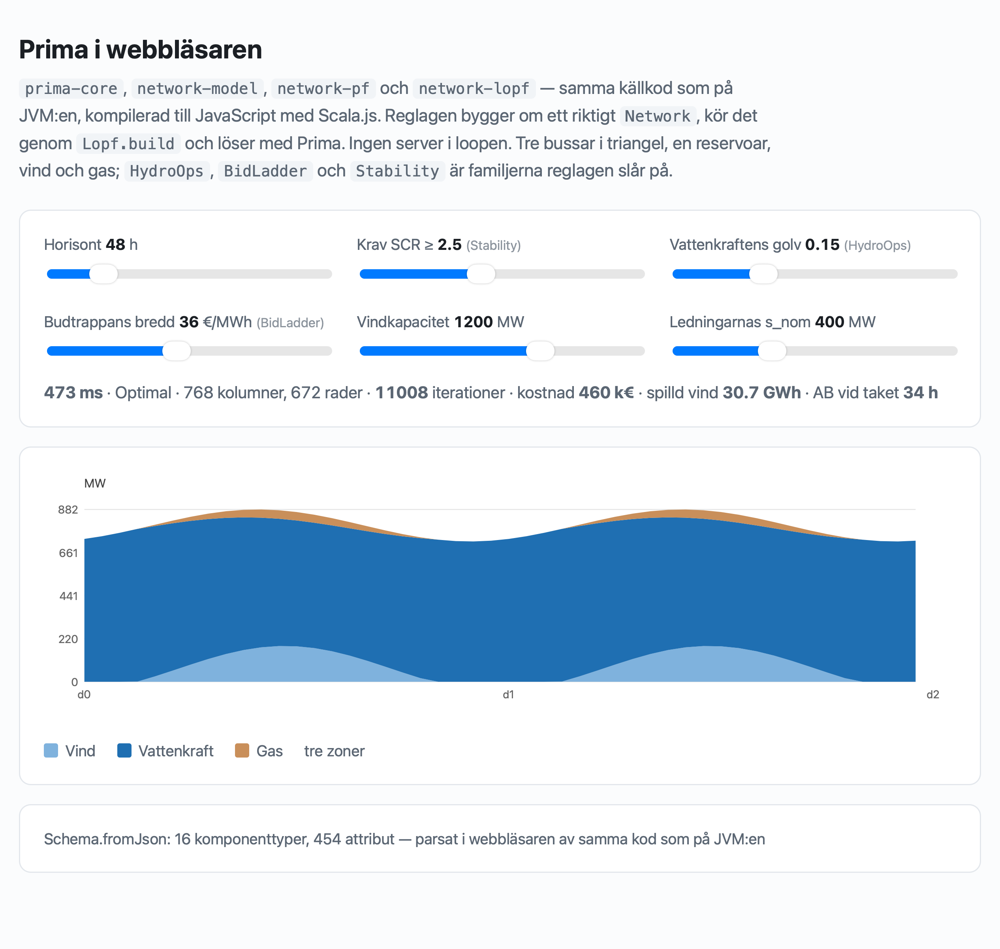

# Prima in a browser

`prima-core`, `network-model`, `network-pf` and `network-lopf`, compiled to JavaScript with
Scala.js. The page builds a real `Network`, runs it through the real `Lopf.build`, and solves
it with Prima — no server in the loop.



Live: <https://oluies.github.io/noaidi/>

## What was measured

The question was not "does it compile" but "is it fast enough to put behind a slider". Two
findings, and the second is the one that matters.

**Scala.js costs about 10× the JVM per unit of work.** Per column per iteration:

| | |
| --- | --- |
| JVM, `nordic-today`, 57,305 columns | **4.4 ns** |
| Safari, this demo, 240–1,680 columns | **43–61 ns** |

**But the iteration count is what actually limits the size**, and it is the same on both
platforms. Holding everything else fixed and lengthening the horizon:

| horizon | columns | iterations | time |
| --- | --- | --- | --- |
| 24 h | 240 | 4,288 | 63 ms |
| 48 h | 480 | 16,448 | 349 ms |
| 72 h | 720 | 50,688 | 1.6 s |
| 168 h | 1,680 | 47,680 | 3.5 s |

Seven times the columns, but eleven times the iterations. The reservoir's state of charge
chains every snapshot to the next, and a first-order method is sensitive to the conditioning
that produces — `nordic-today` needs 233,344 iterations on the JVM for the same reason. So
the ceiling on an in-browser model is not the language: a couple of days of a small network
is comfortable, a year of a real one is not, and moving to the JVM buys one order of
magnitude, not three.

A hand-built LP with no inter-temporal coupling solves 840 columns in 29 ms here, against
3.5 s for 1,680 coupled ones. The coupling, not the size, is the cost.

## What the sliders do

The model is three buses in a triangle — so every line's removal leaves it connected, the
same reason `sclopf-families` is one — with a reservoir at A, wind and a peaker at C, gas at
B. Three of the sliders switch on the constraint families this repository ported from
NordPSA, and they are the same code the JVM runs:

- **`Stability`** — `s_h·u_h + s_g·u_g ≥ SCR·p_wind` over a linearised commitment
  (`p ≤ u`, `p ≥ m_min·u`), with NordPSA's own `s_coef` values
- **`HydroOps`** — an hourly floor under the reservoir's output
- **`BidLadder`** — the reservoir's flat bid split into three rising tiers

Raising SCR brings synchronous plant online, makes it produce, and curtails the wind when
that is not enough. That is the mechanism the whole `stability` port exists to express.

## What had to change in the ported modules

One file, and not the one expected. `java.time` — the obvious candidate, confined to
`HydroOps.scala` — needed only the `scala-java-time` dependency and no source change at all.

What did need a change was `StandardTypes`, which loads PyPSA's line-type library from a
**classpath resource**, and a browser has no classpath. The read is now in
`StandardTypeLibrary.scala`, 25 lines of its own, which `network-model-js` excludes and
replaces with a generated file embedding the same CSVs from `src/main/resources`. Generated
rather than committed, so there is still exactly one copy of the data and a line type added
to the library reaches both platforms or neither.

Otherwise: `VectorKernels.scala` is excluded (`jdk.incubator.vector`, already behind the
`Kernels` trait with `ScalaKernels` as the fallback, and unreachable anyway). `Unsafe` is two
`asInstanceOf` casts. No threads, no `Future`. `Schema.fromFile`, `CsvReader.read` and
`MpsReader.fromFile` link out as unreachable — a browser fetches over HTTP, which is what the
page does, and `Schema.fromJson` then parses the schema with the same code the JVM uses.

## Which modules are ported

| ported | not ported, and why |
| --- | --- |
| `prima-core` | `network-io` — HDF5 through `jhdf`, and no filesystem to point it at |
| `prima-model` | `prima-ojalgo` — wraps a Java solver |
| `prima-mps` | `prima-ortools` — wraps a native one |
| `network-model` | `prima-cyfra` — a Vulkan backend |
| `network-pf` | `prima-netlib`, `prima-validation` — file-based benchmark suites |
| `network-lopf` | `prima-zio` — could be, and is left out because nothing here is effectful |

Not a `crossProject`: that moves every source file into a `.jvm`/`.js` layout and touches
every module depending on these six. The JS projects point `unmanagedSourceDirectories` at
the existing sources instead, so there is one copy of the code and the JVM build is
untouched.

## Sizes

| | |
| --- | --- |
| `fastLinkJS` | 1.7 MB |
| `fullLinkJS` | 1.07 MB |
| `fullLinkJS`, gzipped | **171 KB** |

## Running it locally

```bash
sbt demoJs/fullLinkJS
cp target/out/sjs1/scala-3.9.0/demo-js/demo-js-opt/main.js modules/demo-js/public/
cp reference/goldens/schema.json modules/demo-js/public/
cd modules/demo-js/public && python3 -m http.server 8731
```

`main.js` and `schema.json` are build outputs and are not committed; `.github/workflows/pages.yml`
produces them the same way for the published page.

## Would a GPU help?

Not in a browser, and the reason is the algorithm rather than WebGPU. `Kernels` is already
the abstraction a GPU backend plugs into — `prima-cyfra` is one — but PDHG's adaptive
step-size rule performs three reductions **per iteration** (`squaredNorm(dx)`,
`squaredNorm(dy)`, `dot(dy, kdx)`) and branches on the results inside the iteration. On
Vulkan you can wait on a fence cheaply; in JavaScript you cannot block at all, so each of
those becomes an awaited buffer mapping. At 48,000 iterations that is 144,000 round trips,
which is slower than doing the arithmetic on the CPU. The KKT check is every 64 iterations
and is not the problem; the step-size rule is.
